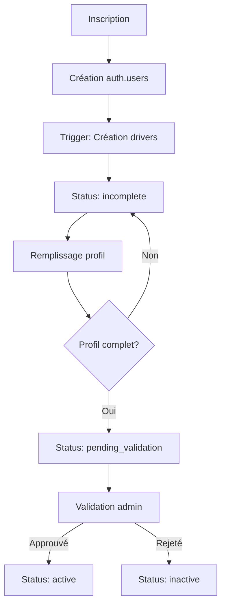
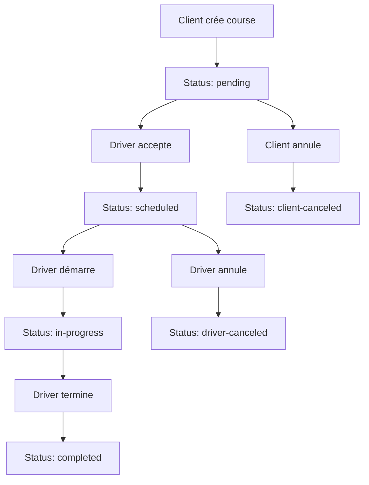

## 🎯 **VISION D'ENSEMBLE DU SYSTÈME**

### **🔍 Vérification de Complétude : `check_driver_profile_completeness`**

-- Vérifie si un profil chauffeur est complet
SELECT * FROM check_driver_profile_completeness('user-uuid-here');

-- Voir section "Vérification de Complétude : check_driver_profile_completeness" ci-dessus pour la description complète et l’exemple d’appel.

2. Appelle la fonction de complétude (voir section dédiée)

  // Voir section "Vérification de Complétude" pour l’intégration complète
  .rpc('check_driver_profile_completeness', { driver_user_id: userId })

  -- Voir section "Vérification de Complétude : check_driver_profile_completeness"

-- Voir section "Vérification de Complétude : check_driver_profile_completeness"
# 🛡️ DOCUMENTATION SYSTÈME COMPLET - GESTION AUTOMATIQUE DES PROFILS, STATUTS ET RÔLES

## 📅 **DERNIÈRE MISE À JOUR**
**Date** : 3 juillet 2025  
**Basé sur** : Types Supabase générés + Scripts SQL récents  
**Statut** : ✅ Architecture fonctionnelle et déployée

---

## 🎯 **VISION D'ENSEMBLE DU SYSTÈME**

### **🏗️ Architecture Complète**

```
Frontend (Next.js/React)
    ↓ JWT avec app_metadata.role
Supabase Auth + RLS
    ↓ Triggers automatiques
Tables (drivers, users, rides)
    ↓ Fonctions SQL métier
Gestion automatique des statuts
```

### **✨ Fonctionnalités Automatiques**
- ✅ **Gestion automatique des statuts** via triggers SQL
- ✅ **Validation complète des profils** en temps réel  
- ✅ **Sécurité par RLS** basée sur JWT
- ✅ **Synchronisation automatique** des données
- ✅ **Rapports et analytics** intégrés

---

## 📊 **SCHÉMA DE BASE DE DONNÉES (2025)**

### **👤 Table `drivers` - Profils des Chauffeurs**

```typescript
interface DriverRecord {
  // Identifiants
  id: string                          // UUID primary key
  user_id: string                     // Référence vers auth.users
  
  // Informations personnelles
  first_name: string | null
  last_name: string | null
  phone: string | null
  date_of_birth: string | null
  
  // Adresse
  address_line1: string | null
  address_line2: string | null  
  city: string | null
  postal_code: string | null
  
  // Informations professionnelles
  company_name: string | null
  company_phone: string | null
  employee_name: string | null
  employee_phone: string | null
  
  // Documents et certifications
  driving_license_number: string | null
  driving_license_expiry_date: string | null
  insurance_number: string | null
  insurance_expiry_date: string | null
  vtc_card_number: string | null
  vtc_card_expiry_date: string | null
  
  // Contact d'urgence
  emergency_contact_name: string | null
  emergency_contact_phone: string | null
  
  // Fichiers et média
  avatar_url: string | null
  document_urls: Json | null          // URLs des documents uploadés
  
  // Préférences et configuration
  languages_spoken: string[] | null
  preferred_zones: string[] | null
  availability_hours: Json | null
  
  // Statistiques et évaluation
  rating: number | null
  total_rides: number | null
  
  // Statut et véhicule
  status: driver_status              // ENUM géré automatiquement
  current_vehicle_id: string | null
  
  // Timestamps
  created_at: string
  updated_at: string
}
```

### **🚗 Table `rides` - Gestion des Courses**

```typescript
interface RideRecord {
  // Identifiants
  id: string
  user_id: string                    // Client
  driver_id: string | null           // Chauffeur assigné
  
  // Informations de course
  pickup_address: string
  pickup_latitude: number
  pickup_longitude: number
  destination_address: string
  destination_latitude: number
  destination_longitude: number
  
  // Timing
  scheduled_at: string | null
  started_at: string | null
  completed_at: string | null
  
  // Pricing et paiement
  estimated_price: number | null
  final_price: number | null
  
  // Statut de la course
  status: ride_status               // ENUM avec workflow
  
  // Métadonnées
  vehicle_type: vehicle_type_enum
  passenger_count: number | null
  notes: string | null
  
  // Timestamps
  created_at: string
  updated_at: string
}
```

### **👥 Table `users` - Profils Utilisateurs**

```typescript
interface UserRecord {
  id: string                        // Correspond à auth.users.id
  first_name: string | null
  last_name: string | null
  phone: string | null
  created_at: string
  updated_at: string
}
```

---

## 🎯 **ÉNUMÉRATIONS (ENUMS) SYSTÈME**

### **📋 Statuts des Chauffeurs (`driver_status`)**

```typescript
type DriverStatus = 
  | "pending_validation"    // En attente de validation admin
  | "active"               // Actif et disponible
  | "inactive"             // Inactif/rejeté par admin
  | "on_vacation"          // En vacances
  | "suspended"            // Suspendu temporairement
  | "incomplete"           // Profil incomplet (automatique)
```

**📈 Flux automatique des statuts :**
```
inscription → incomplete → pending_validation → active/inactive
                ↑               ↓
            (trigger)      (validation admin)
```

### **🚗 Statuts des Courses (`ride_status`)**

```typescript
type RideStatus =
  | "pending"              // Créée, en attente d'attribution
  | "scheduled"            // Assignée à un chauffeur  
  | "in-progress"          // En cours de réalisation
  | "completed"            // Terminée avec succès
  | "client-canceled"      // Annulée par le client
  | "driver-canceled"      // Annulée par le chauffeur
  | "admin-canceled"       // Annulée par l'admin
  | "no-show"             // Client absent
  | "delayed"             // Retardée
```

### **🚙 Types de Véhicules (`vehicle_type_enum`)**

```typescript
type VehicleType =
  | "STANDARD"             // Véhicule standard
  | "PREMIUM"              // Véhicule haut de gamme
  | "VAN"                  // Véhicule utilitaire
  | "ELECTRIC"             // Véhicule électrique
```

---

## ⚙️ **FONCTIONS SQL MÉTIER**

### **🔍 Vérification de Complétude : `check_driver_profile_completeness`**

```sql
-- Vérifie si un profil chauffeur est complet
SELECT * FROM check_driver_profile_completeness('user-uuid-here');
```

**🔧 Paramètres :**
- `driver_user_id: string` - UUID de l'utilisateur

**📊 Retour :**
```typescript
{
  is_complete: boolean,              // Profil 100% complet ?
  completion_percentage: number,      // Pourcentage (0-100)
  missing_fields: string[]           // Champs manquants
}
```

**✅ Champs obligatoires vérifiés :**
1. `first_name` - Prénom
2. `phone` - Téléphone  
3. `company_name` - Nom entreprise
4. `company_phone` - Téléphone entreprise
5. `driving_license_number` - Numéro permis
6. `driving_license_expiry_date` - Expiration permis
7. `vtc_card_number` - Numéro carte VTC
8. `vtc_card_expiry_date` - Expiration carte VTC

### **🔄 Mise à Jour Automatique : `force_update_driver_status`**

```sql
-- Force la mise à jour du statut d'un chauffeur
SELECT * FROM force_update_driver_status('user-uuid-here');
```

**📊 Retour :**
```typescript
{
  driver_id: string,
  old_status: driver_status,
  new_status: driver_status,
  is_complete: boolean,
  completion_percentage: number
}
```

**🎯 Logique automatique :**
- Si `is_complete = true` → `pending_validation`
- Si `is_complete = false` → `incomplete`
- Respecte les statuts protégés (`active`, `suspended`, etc.)

### **🔧 Correction en Masse : `fix_all_driver_statuses`**

```sql
-- Corrige tous les statuts de chauffeurs d'un coup
SELECT * FROM fix_all_driver_statuses();
```

**📊 Retour :**
```typescript
{
  updated_count: number,           // Chauffeurs mis à jour
  incomplete_count: number,        // Total incomplets
  pending_validation_count: number, // Total en attente
  active_count: number,            // Total actifs
  inactive_count: number,          // Total inactifs
  rejected_count: number,          // Total rejetés
  suspended_count: number          // Total suspendus
}
```

### **📈 Rapports et Analytics**

#### **`get_drivers_completeness_stats` - Statistiques Globales**
```sql
SELECT * FROM get_drivers_completeness_stats();
```

**📊 Retour :**
```typescript
{
  total_drivers: number,
  complete_drivers: number,
  incomplete_drivers: number,
  pending_validation: number,
  average_completion_percentage: number
}
```

#### **`get_incomplete_drivers_report` - Rapport Détaillé**
```sql
SELECT * FROM get_incomplete_drivers_report();
```

**📊 Retour :**
```typescript
{
  user_id: string,
  first_name: string,
  last_name: string,
  status: driver_status,
  is_complete: boolean,
  completion_percentage: number,
  missing_fields: string[]
}[]
```

### **🔐 Fonctions de Rôles et Permissions**

#### **`is_admin()` - Vérification Admin**
```sql
SELECT is_admin(); -- true/false
```

#### **`is_super_admin()` - Vérification Super Admin**
```sql
SELECT is_super_admin(); -- true/false
```

#### **`get_user_role()` - Récupération du Rôle**
```sql
SELECT get_user_role(); -- 'app_driver', 'app_admin', etc.
```

---

## 🤖 **TRIGGERS AUTOMATIQUES**

### **📊 Trigger Principal : `trigger_auto_update_driver_status`**

**🎯 Déclenchement :**
- Se déclenche automatiquement lors de la mise à jour des champs :
  - `first_name`, `last_name`, `phone`, `date_of_birth`
  - `avatar_url`, `document_urls`
  - Champs de documents professionnels

**⚡ Fonctionnement :**
1. **AVANT** la mise à jour (BEFORE UPDATE)
2. Appelle `check_driver_profile_completeness()`
3. Met à jour le `status` si nécessaire
4. Met à jour `updated_at` automatiquement

**🔄 Logique de statut :**
```sql
-- Si profil complet ET statut en attente/incomplet
IF is_complete AND status IN ('incomplete', 'pending_validation') THEN
  new_status := 'pending_validation';

-- Si profil incomplet ET statut en attente/incomplet  
ELSIF NOT is_complete AND status IN ('pending_validation', 'incomplete') THEN
  new_status := 'incomplete';

-- Sinon garder le statut existant (protège active, suspended, etc.)
ELSE
  new_status := current_status;
END IF;
```

---

## 🛡️ **SYSTÈME DE SÉCURITÉ RLS**

### **🔑 Rôles Système**

```typescript
type UserRole =
  | "app_driver"        // Chauffeur de la plateforme
  | "app_customer"      // Client qui réserve
  | "app_admin"         // Administrateur
  | "app_super_admin"   // Super administrateur
```

### **📋 Politiques RLS par Table**

#### **🚗 Table `drivers`**
```sql
-- Accès personnel (chauffeur voit son profil)
CREATE POLICY "drivers_own_access" ON drivers
FOR ALL USING (user_id = auth.uid());

-- Accès admin complet
CREATE POLICY "drivers_admin_access" ON drivers  
FOR ALL USING (
  (auth.jwt() ->> 'app_metadata')::jsonb ->> 'role' 
  IN ('app_admin', 'app_super_admin')
);
```

#### **🚗 Table `rides`**
```sql
-- Courses disponibles (driver peut voir)
CREATE POLICY "rides_available_for_drivers" ON rides
FOR SELECT USING (
  driver_id IS NULL 
  AND (auth.jwt() ->> 'app_metadata')::jsonb ->> 'role' = 'app_driver'
);

-- Accepter/modifier une course
CREATE POLICY "rides_accept_by_driver" ON rides
FOR UPDATE USING (
  (driver_id IS NULL OR driver_id = (SELECT id FROM drivers WHERE user_id = auth.uid()))
  AND (auth.jwt() ->> 'app_metadata')::jsonb ->> 'role' = 'app_driver'
) WITH CHECK (
  driver_id = (SELECT id FROM drivers WHERE user_id = auth.uid())
  AND status IN ('scheduled', 'in-progress', 'completed', 'cancelled')
);
```

### **✅ Pattern de Vérification JWT (OBLIGATOIRE)**

```sql
-- ✅ CORRECT - Utilise le JWT pour les permissions temps réel
(auth.jwt() ->> 'app_metadata')::jsonb ->> 'role' = 'app_driver'

-- ❌ INCORRECT - Cause des erreurs 403  
auth.users.raw_app_meta_data ->> 'role' = 'app_driver'
```

---

## 🔄 **WORKFLOWS AUTOMATISÉS**

### **📝 Workflow Inscription Chauffeur**



### **🔄 Workflow Gestion Course**



---

## 🚀 **UTILISATION PRATIQUE**

### **🔧 Côté Frontend (React/Next.js)**

#### **Vérifier la complétude d'un profil**
```typescript
// Hook TanStack Query
const useDriverProfileCompleteness = (userId: string) => {
  return useQuery({
    queryKey: ['driver-profile-completeness', userId],
    queryFn: async () => {
      const { data, error } = await supabase
        .rpc('check_driver_profile_completeness', { 
          driver_user_id: userId 
        })
        .single()
      
      if (error) throw error
      return data
    },
    enabled: !!userId,
    staleTime: 30 * 1000 // 30 secondes
  })
}

// Utilisation dans un composant
const { data: completeness, isLoading } = useDriverProfileCompleteness(userId)

if (completeness && !completeness.is_complete) {
  return (
    <Alert>
      <AlertTriangle className="h-4 w-4" />
      <AlertTitle>Profil incomplet ({completeness.completion_percentage}%)</AlertTitle>
      <AlertDescription>
        Champs manquants : {completeness.missing_fields.join(', ')}
      </AlertDescription>
    </Alert>
  )
}
```

#### **Forcer la mise à jour d'un statut**
```typescript
const forceUpdateStatus = async (userId: string) => {
  const { data, error } = await supabase
    .rpc('force_update_driver_status', { 
      driver_user_id: userId 
    })
    .single()
  
  if (error) throw error
  
  console.log(`Statut mis à jour: ${data.old_status} → ${data.new_status}`)
  return data
}
```

#### **Callback après upload de document**
```typescript
const handleDocumentUpload = async (documentType: string) => {
  // Forcer la mise à jour du statut après upload
  await forceUpdateStatus(driver.user_id)
  
  // Recharger les données
  queryClient.invalidateQueries(['driver-profile', driver.id])
  queryClient.invalidateQueries(['driver-profile-completeness', driver.user_id])
  
  toast({
    title: "✅ Document uploadé",
    description: "Statut du profil mis à jour automatiquement"
  })
}
```

### **📊 Côté Admin - Analytics**

```typescript
// Statistiques globales
const { data: stats } = useQuery({
  queryKey: ['drivers-stats'],
  queryFn: async () => {
    const { data, error } = await supabase
      .rpc('get_drivers_completeness_stats')
      .single()
    
    if (error) throw error
    return data
  }
})

// Rapport des profils incomplets
const { data: incompleteDrivers } = useQuery({
  queryKey: ['incomplete-drivers'],
  queryFn: async () => {
    const { data, error } = await supabase
      .rpc('get_incomplete_drivers_report')
    
    if (error) throw error
    return data
  }
})
```

---

## 🔧 **DÉPLOIEMENT ET MAINTENANCE**

### **📝 Installation Initiale**

1. **Exécuter les scripts SQL** dans l'ordre :
   ```sql
   -- 1. Créer les fonctions de base
   \i scripts/verification-profil-complet.sql
   
   -- 2. Ajouter les triggers automatiques  
   \i scripts/add-triggers-only.sql
   
   -- 3. Corriger les statuts existants
   SELECT * FROM fix_all_driver_statuses();
   ```

2. **Vérifier l'installation** :
   ```sql
   -- Test d'un profil
   SELECT * FROM check_driver_profile_completeness('user-uuid');
   
   -- Statistiques globales
   SELECT * FROM get_drivers_completeness_stats();
   ```

### **🔄 Maintenance Régulière**

#### **Correction des statuts (hebdomadaire)**
```sql
SELECT * FROM fix_all_driver_statuses();
```

#### **Rapport de santé du système**
```sql
-- Vérifier les triggers actifs
SELECT * FROM information_schema.triggers 
WHERE trigger_name LIKE '%driver%';

-- Statistiques des profils
SELECT * FROM get_drivers_completeness_stats();

-- Top 10 profils incomplets
SELECT * FROM get_incomplete_drivers_report() 
ORDER BY completion_percentage ASC 
LIMIT 10;
```

---

## 🐛 **DÉPANNAGE**

### **❌ Problèmes Fréquents**

#### **Statut ne se met pas à jour automatiquement**
```sql
-- Diagnostic
SELECT * FROM check_driver_profile_completeness('user-uuid');

-- Correction manuelle
SELECT * FROM force_update_driver_status('user-uuid');
```

#### **Erreur 403 sur les permissions**
```sql
-- Vérifier le rôle de l'utilisateur
SELECT get_user_role();

-- Vérifier les politiques RLS
SELECT schemaname, tablename, policyname, permissive, roles, cmd, qual 
FROM pg_policies 
WHERE tablename IN ('drivers', 'rides', 'users');
```

#### **Trigger ne se déclenche pas**
```sql
-- Vérifier que le trigger existe
SELECT * FROM information_schema.triggers 
WHERE trigger_name = 'trigger_auto_update_driver_status';

-- Recréer si nécessaire
DROP TRIGGER IF EXISTS trigger_auto_update_driver_status ON drivers;
-- Puis exécuter add-triggers-only.sql
```

### **📊 Logs et Monitoring**

```sql
-- Voir les logs des triggers (si RAISE NOTICE activé)
SELECT * FROM pg_stat_activity WHERE query LIKE '%driver%';

-- Statistiques de performance
SELECT * FROM pg_stat_user_functions 
WHERE funcname LIKE '%driver%';
```

---

## 📋 **RÉSUMÉ DES BONNES PRATIQUES**

### **✅ À FAIRE**

1. **Toujours utiliser le pattern JWT** pour les RLS :
   ```sql
   (auth.jwt() ->> 'app_metadata')::jsonb ->> 'role'
   ```

2. **Laisser les triggers gérer les statuts** automatiquement

3. **Utiliser `force_update_driver_status()`** après upload manuel

4. **Implémenter les callbacks** pour recharger les données

5. **Monitorer régulièrement** avec `get_drivers_completeness_stats()`

### **❌ À ÉVITER**

1. **Ne pas utiliser `raw_app_meta_data`** dans les politiques RLS

2. **Ne pas modifier le statut manuellement** sans passer par les fonctions

3. **Ne pas ignorer les erreurs** des fonctions RPC

4. **Ne pas oublier l'invalidation du cache** après modifications

---

## 🎯 **CONCLUSION**

Ce système offre une gestion **complètement automatisée** des profils et statuts de chauffeurs avec :

- ✅ **Triggers automatiques** pour la cohérence des données
- ✅ **Validation en temps réel** de la complétude des profils  
- ✅ **Sécurité robuste** via RLS et JWT
- ✅ **Analytics intégrés** pour le monitoring
- ✅ **APIs simples** pour l'intégration frontend

**🚀 Résultat** : Une plateforme VTC entreprise robuste, sécurisée et entièrement automatisée !
