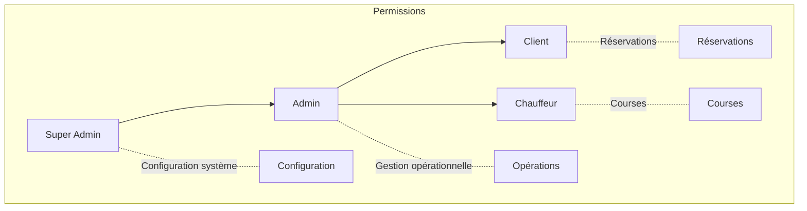
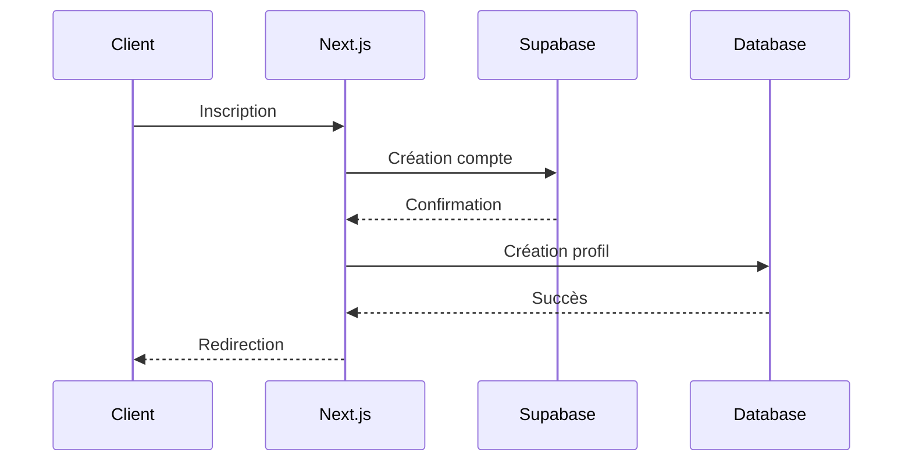
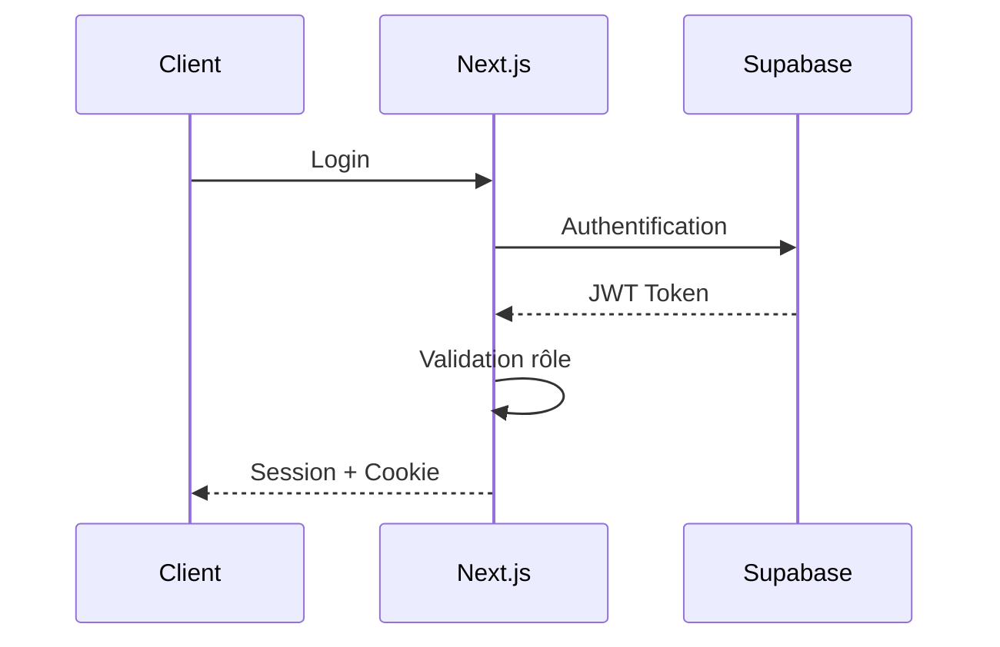

# Système d'authentification

## Vue d'ensemble

L'authentification est gérée par Supabase Auth avec des permissions personnalisées via Row Level Security (RLS) et un système de rôles hiérarchique.

## Types d'utilisateurs

| Rôle | Description | Permissions |
|------|-------------|-------------|
| `superAdmin` | Administrateur système | Accès total au système |
| `admin` | Gestionnaire | Gestion des utilisateurs et opérations |
| `client` | Client final | Réservation et suivi des courses |
| `driver` | Chauffeur VTC | Gestion des courses attribuées |

## Hiérarchie des permissions



## Flux d'authentification

### Inscription



### Connexion



## Middleware de protection

```typescript
// middleware.ts
export const middleware = async (req: NextRequest) => {
  // Vérification de session
  const session = await getSession()
  
  // Routes protégées par rôle
  if (isProtectedRoute(req.url)) {
    const role = session?.user?.role
    if (!hasRequiredRole(role, req.url)) {
      return redirectToLogin()
    }
  }
}
```

## Politiques RLS

### Tables principales

```sql
-- Politique utilisateurs
CREATE POLICY "Les utilisateurs voient leur propre profil"
ON users FOR SELECT
USING (auth.uid() = id);

-- Politique courses
CREATE POLICY "Les clients voient leurs courses"
ON rides FOR SELECT
USING (
  auth.uid() = user_id 
  OR 
  auth.uid() IN (
    SELECT id FROM users WHERE role IN ('admin', 'superAdmin')
  )
);
```

### Fonctions de vérification

```sql
CREATE OR REPLACE FUNCTION check_user_role(required_role text)
RETURNS boolean AS $$
BEGIN
  RETURN EXISTS (
    SELECT 1 FROM users 
    WHERE id = auth.uid() 
    AND role::text = required_role
  );
END;
$$ LANGUAGE plpgsql SECURITY DEFINER;
```

## Gestion des sessions

- Durée de session : 24 heures
- Refresh token : 7 jours
- Déconnexion automatique après inactivité

## Sécurité

### Mesures implémentées

- Protection CSRF
- Rate limiting
- Validation des données
- Audit logs
- Sessions sécurisées
- HTTPS forcé

### Headers de sécurité

```typescript
// next.config.js
const securityHeaders = [
  {
    key: 'X-Frame-Options',
    value: 'DENY'
  },
  {
    key: 'X-Content-Type-Options',
    value: 'nosniff'
  }
  // ...autres headers
]
```

## Tests de sécurité

```bash
# Test des rôles
npm run test:roles

# Test des permissions
npm run test:permissions

# Test des politiques RLS
npm run test:rls
```

## Gestion des mots de passe

- Hashage : Argon2
- Rotation forcée : 90 jours
- Complexité minimale requise
- Historique des mots de passe

## Audit et monitoring

- Logs de connexion
- Tentatives échouées
- Changements de rôles
- Actions administratives
- Alertes de sécurité
