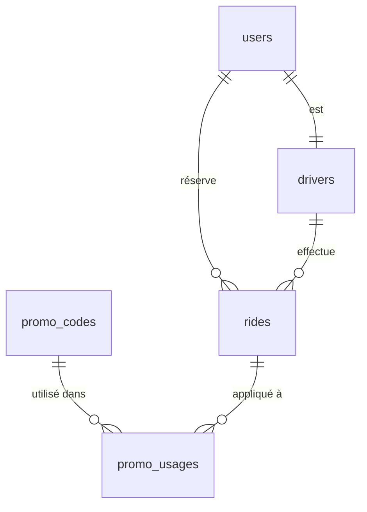

# Architecture de la base de données

## Vue d'ensemble

La base de données PostgreSQL (via Supabase) est structurée autour de plusieurs domaines clés :
- Gestion des utilisateurs et authentification
- Gestion des courses VTC
- Système de tarification et promotions
- Administration des chauffeurs et véhicules

## Types énumérés

```sql
-- Rôles utilisateurs
CREATE TYPE user_role AS ENUM (
    'superAdmin',
    'admin',
    'client',
    'driver'
);

-- Statuts des courses
CREATE TYPE ride_status AS ENUM (
    'unassigned',  -- Course créée mais sans chauffeur
    'pending',     -- En attente de confirmation
    'in-progress', -- Course en cours
    'completed',   -- Course terminée
    'canceled'    -- Course annulée
);

-- Types de véhicules
CREATE TYPE vehicle_type_enum AS ENUM (
    'STANDARD',
    'PREMIUM',
    'ELECTRIC',
    'VAN'
);

-- Types de promotions
CREATE TYPE promo_type_enum AS ENUM (
    'percentage',
    'fixed_amount',
    'free_options'
);
```

## Tables principales

### Utilisateurs et Authentification

```sql
-- Table des utilisateurs
CREATE TABLE users (
    id uuid PRIMARY KEY,
    email TEXT UNIQUE NOT NULL,
    role user_role NOT NULL,
    last_login TIMESTAMPTZ,
    created_at TIMESTAMPTZ,
    updated_at TIMESTAMPTZ
);

-- Table des chauffeurs
CREATE TABLE drivers (
    id uuid PRIMARY KEY,
    user_id uuid REFERENCES users,
    name TEXT NOT NULL,
    vtc_card_number TEXT UNIQUE,
    driving_license_number TEXT UNIQUE,
    status driver_status,
    rating DECIMAL,
    total_rides INTEGER,
    languages_spoken TEXT[],
    preferred_zones TEXT[],
    created_at TIMESTAMPTZ,
    updated_at TIMESTAMPTZ
);
```

### Gestion des courses

```sql
-- Table des courses
CREATE TABLE rides (
    id uuid PRIMARY KEY,
    user_id uuid REFERENCES users,
    driver_id uuid REFERENCES drivers,
    status ride_status NOT NULL,
    pickup_address TEXT NOT NULL,
    dropoff_address TEXT NOT NULL,
    pickup_time TIMESTAMPTZ NOT NULL,
    estimated_price DECIMAL,
    created_at TIMESTAMPTZ,
    updated_at TIMESTAMPTZ
);
```

### Système de promotions

```sql
-- Codes promo généraux
CREATE TABLE promo_codes (
    id uuid PRIMARY KEY,
    code TEXT UNIQUE NOT NULL,
    promo_type promo_type_enum,
    value DECIMAL,
    max_uses INTEGER,
    uses_per_user INTEGER,
    created_at TIMESTAMPTZ,
    updated_at TIMESTAMPTZ
);

-- Suivi des utilisations
CREATE TABLE promo_usages (
    id uuid PRIMARY KEY,
    promo_code_id uuid REFERENCES promo_codes,
    user_id uuid REFERENCES users,
    ride_id uuid REFERENCES rides,
    used_at TIMESTAMPTZ
);

-- Réductions entreprises
CREATE TABLE corporate_discounts (
    id uuid PRIMARY KEY,
    company_id uuid REFERENCES users,
    percentage DECIMAL,
    min_monthly_rides INTEGER,
    remaining_budget DECIMAL,
    created_at TIMESTAMPTZ,
    updated_at TIMESTAMPTZ
);
```

## Indexation et Performance

```sql
-- Index pour la recherche de courses
CREATE INDEX idx_rides_status ON rides(status);
CREATE INDEX idx_rides_pickup_time ON rides(pickup_time);

-- Index pour les promotions
CREATE INDEX idx_promo_codes_code ON promo_codes(code);
CREATE INDEX idx_promo_usages_user ON promo_usages(user_id);

-- Index pour les chauffeurs
CREATE INDEX idx_drivers_status ON drivers(status);
CREATE INDEX idx_drivers_rating ON drivers(rating);
```

## Relations clés



## Triggers

- Mise à jour automatique des timestamps (updated_at)
- Calcul automatique des notes chauffeurs
- Vérification des limites de promotions
- Mise à jour des statistiques chauffeurs

## Politiques de sécurité

```sql
-- Exemple de politique RLS
CREATE POLICY "Les utilisateurs voient leurs propres courses"
ON rides FOR SELECT
USING (auth.uid() = user_id);
```

## Maintenance

- Nettoyage périodique des codes promo expirés
- Archivage des courses anciennes
- Optimisation des index
- Vacuum analyse régulier
