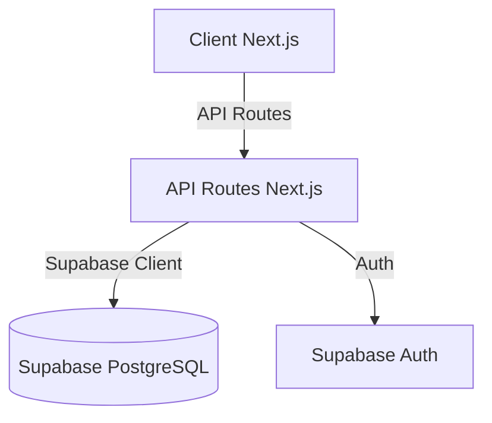
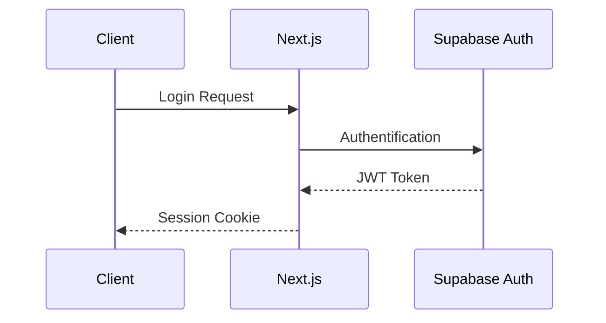
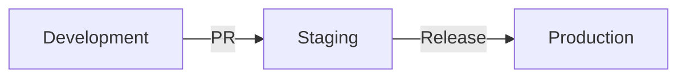

# Vue d'ensemble du système

## Architecture globale

L'application Élégance Mobilité utilise une architecture moderne basée sur :

## Composants principaux

### Frontend (Next.js 14)
- **App Router** : Routage basé sur les dossiers
- **Server Components** : Performance et SEO optimisés
- **Client Components** : Interactivité utilisateur
- **API Routes** : Points d'entrée backend

### Base de données (Supabase)
- PostgreSQL avec extensions
- Authentification intégrée
- Temps réel avec WebSockets
- Stockage de fichiers

### Services externes
- Leaflet pour la cartographie
- Stripe pour les paiements
- SendGrid pour les emails

## Flux d'authentification

## Fonctionnalités clés

1. **Gestion des courses**
   - Réservation en temps réel
   - Suivi GPS
   - Historique des trajets

2. **Administration des chauffeurs**
   - Tableau de bord
   - Gestion des disponibilités
   - Suivi des performances

3. **Système de tarification**
   - Tarifs dynamiques
   - Codes promo
   - Facturation automatique

## Sécurité

- JWT pour l'authentification
- RBAC (Role Based Access Control)
- Protection CSRF
- Rate Limiting
- Validation des données

## Performance

- Cache côté client et serveur
- Images optimisées
- Bundling intelligent
- Code splitting automatique

## Monitoring

- Logs applicatifs
- Métriques de performance
- Alertes en temps réel
- Suivi des erreurs

## Déploiement

## Infrastructure

- Vercel pour l'hébergement
- Supabase pour la base de données
- CDN pour les assets
- CI/CD automatisé
