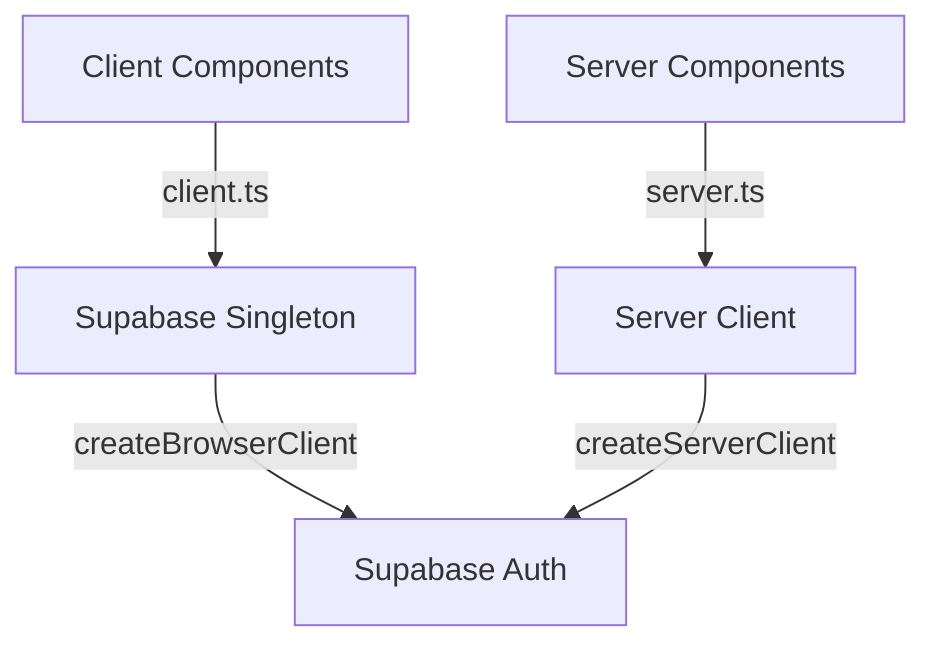

# Architecture Client/Serveur de l'Authentification

## Vue d'Ensemble

L'authentification utilise une architecture hybride avec @supabase/ssr :
- `client.ts` fournit un singleton Supabase pour tous les composants clients
- `server.ts` fournit les utilitaires d'authentification côté serveur



## Architecture Client

### 1. Client Singleton (client.ts)
```typescript
'use client'

import { createBrowserClient } from '@supabase/ssr'

// Client Supabase singleton pour le navigateur
export const supabase = createBrowserClient(
  process.env.NEXT_PUBLIC_SUPABASE_URL!,
  process.env.NEXT_PUBLIC_SUPABASE_ANON_KEY!
)

// Helper pour la déconnexion
export async function signOut() {
  const { error } = await supabase.auth.signOut()
  return {
    success: !error,
    error: error?.message
  }
}
```

### 2. Utilisation dans LoginForm
```typescript
// LoginForm.tsx ('use client')
import { supabase } from '@/lib/database/client'

export function LoginForm() {
  async function onSubmit(event: React.FormEvent<HTMLFormElement>) {
    const { data, error } = await supabase.auth.signInWithPassword({
      email,
      password
    })
    // ...
  }
}
```

## Architecture Serveur

### 1. Utilitaires Serveur (server.ts)
```typescript
'use server'

import { createServerClient } from '@supabase/ssr'

export async function createServerSupabaseClient() {
  return createServerClient(
    process.env.NEXT_PUBLIC_SUPABASE_URL!,
    process.env.NEXT_PUBLIC_SUPABASE_ANON_KEY!,
    {
      cookies: {
        async getAll() {
          // Gestion des cookies
        },
        async setAll(cookieList) {
          // Mise à jour des cookies
        }
      }
    }
  )
}
```

## Avantages de cette Architecture

1. **Singleton Client**
   - Une seule instance Supabase pour tous les composants clients
   - Configuration centralisée
   - Réutilisation du client

2. **Séparation Claire**
   - Les composants clients utilisent uniquement client.ts
   - Les composants serveur utilisent uniquement server.ts
   - Pas de confusion entre les deux contextes

3. **Gestion des Sessions**
   - Le singleton client gère automatiquement les cookies
   - Le serveur peut vérifier la session via les cookies
   - Synchronisation automatique entre client et serveur

## Utilisation Correcte

### Composants Clients
```typescript
import { supabase } from '@/lib/database/client'

// Connexion
const { data, error } = await supabase.auth.signInWithPassword(...)

// Déconnexion
import { signOut } from '@/lib/database/client'
await signOut()
```

### Composants Serveur
```typescript
import { getServerUser } from '@/lib/database/server'

// Vérification de session
const user = await getServerUser()
```

## Bonnes Pratiques

1. **Importations**
   - Toujours importer de client.ts dans les composants clients
   - Toujours importer de server.ts dans les composants serveur
   - Ne jamais mélanger les deux

2. **Gestion d'État**
   - Utiliser le singleton client pour les opérations d'authentification
   - Laisser le serveur gérer les vérifications de session
   - Utiliser les cookies pour la synchronisation

3. **Erreurs**
   - Gérer les erreurs d'authentification côté client
   - Rediriger vers la connexion pour les sessions invalides
   - Maintenir des messages d'erreur cohérents

## Structure Recommandée

```
src/
└── lib/
    └── database/
        ├── client.ts    # Singleton et helpers client
        └── server.ts    # Utilitaires serveur
```

Cette architecture garantit :
- Une seule source de vérité pour l'authentification côté client
- Une séparation claire entre client et serveur
- Une gestion efficace des sessions via les cookies
- Une maintenance simplifiée du code