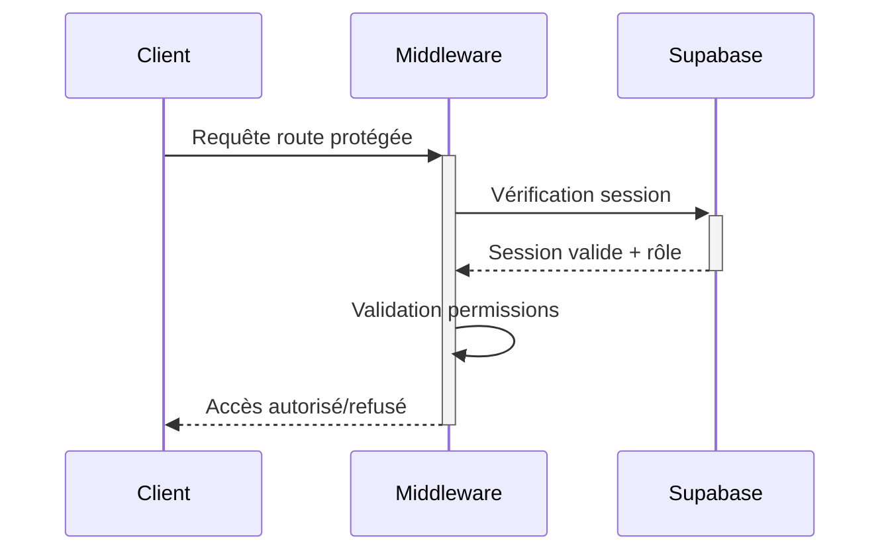

# Architecture de l'Autorisation

## Principes de Base

L'architecture d'autorisation repose sur trois piliers :

1. **Authentification Supabase**
   - Gestion des sessions côté client et serveur
   - Tokens JWT sécurisés
   - Refresh tokens avec rotation

2. **Row Level Security (RLS)**
   - Politiques par table
   - Règles basées sur les rôles
   - Sécurité au niveau de la base de données

3. **Middleware Next.js**
   - Validation des routes
   - Vérification des permissions
   - Redirection selon le rôle

## Flux d'Autorisation



## Implémentation

### 1. Middleware (`src/middleware.ts`)
```typescript
export const config = {
  matcher: ['/admin/:path*', '/driver/:path*']
}

export async function middleware(req: NextRequest) {
  const session = await getSession()
  if (!session) return redirectToLogin()
  
  if (isAdminRoute(req.pathname) && !isAdmin(session))
    return redirectToHome()
}
```

### 2. Politiques RLS
```sql
CREATE POLICY "Users can view their own data"
ON public.users
FOR SELECT USING (
  auth.uid() = id
);
```

### 3. Hooks React
```typescript
export function useRouteGuard() {
  const { user, role } = useUser()
  const router = useRouter()

  useEffect(() => {
    if (!user) router.push('/login')
    if (role !== 'admin') router.push('/')
  }, [user, role])
}
```

## Sécurité

- Session côté serveur via cookies httpOnly
- Validation JWT à chaque requête
- Politiques RLS par défaut restrictives
- Rotation des refresh tokens
