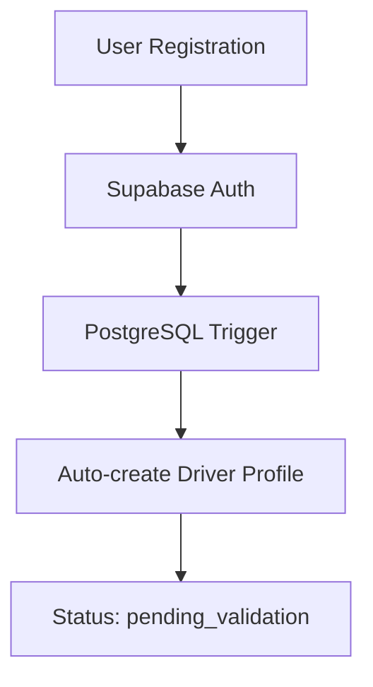

# Driver Workflow - Modern Automated Pipeline

## 🎯 **Vision**: Zero-Touch Driver Onboarding

Enterprise-grade driver registration with **PostgreSQL triggers**, **real-time validation**, and **automated profile management**.

---

## 🏗️ **Architecture Overview**

### Database-First Automation
```sql
-- Automatic driver creation via PostgreSQL triggers
CREATE TRIGGER on_auth_user_created
  AFTER INSERT ON auth.users  
  FOR EACH ROW EXECUTE FUNCTION handle_new_user();
```

**Key Innovation**: Driver profiles are created **automatically** when users register with `role: "driver"` in metadata - no manual intervention required.

---

### 1. Inscription du Chauffeur (/auth/signup/driver)

- Formulaire complet avec validation Zod
- Champs obligatoires :
  - Informations personnelles (nom, prénom, email)
  - Numéro de carte VTC et date d'expiration
  - Numéro de permis et date d'expiration
- Champs optionnels :
  - Informations d'assurance
  - Préférences (zones, langues)

### 2. Création du Compte

- Création de l'utilisateur dans auth.users
- Attribution initiale du portal_type "driver"
- Statut initial "pending_validation" dans la table drivers
- Envoi d'email de confirmation

### 3. Validation Administrative

- Interface admin pour examiner les demandes
- Vérification des documents et informations
- Actions possibles :
  - Approbation : statut -> "active", rôle -> "app_driver"
  - Rejet : statut -> "inactive" avec raison

## Statuts Possibles (driver_status)

- `inactive` : Compte créé mais non actif
- `pending_validation` : En attente de validation administrative
- `active` : Chauffeur validé et actif
- `suspended` : Compte temporairement suspendu

## Sécurité et Permissions

### Politiques RLS

1. Lecture (SELECT)
```sql
auth.uid() = user_id OR
auth.role() IN ('app_admin', 'app_super_admin')
```

2. Insertion (INSERT)
```sql
auth.uid() = user_id AND
status = 'pending_validation'
```

3. Mise à jour (UPDATE)
- Admins : Peuvent tout modifier
- Chauffeurs : Peuvent modifier leurs informations sauf le statut

### Fonctions RPC

1. `create_pending_driver`
- Crée le profil chauffeur
- Vérifie les contraintes
- Sécurisée par SECURITY DEFINER

2. `validate_driver`
- Réservée aux administrateurs
- Gère l'approbation/rejet
- Met à jour le statut et le rôle

## Contraintes de Validation

```sql
- proper_phone : Numéro de téléphone valide
- future_vtc_expiry : Date d'expiration VTC future
- future_license_expiry : Date d'expiration permis future
- future_insurance_expiry : Date d'expiration assurance future (si fournie)
- required_fields : Vérification des champs obligatoires
```

## Notifications

Un système de notifications est implémenté via des triggers pour :
- Confirmation d'inscription
- Résultat de la validation
- Changements de statut

## Interface Utilisateur

1. Formulaire d'inscription (/auth/signup/driver)
- Validation côté client avec Zod
- Gestion des erreurs
- Retours visuels

2. Page d'attente (/driver-portal/pending)
- Affichage du statut
- Instructions
- Contacts support

## Notes Techniques

- Utiliser les fonctions RPC pour les opérations critiques
- Vérifier les dates d'expiration avant validation
- Maintenir les métadonnées utilisateur à jour
- Gérer les erreurs de manière appropriée

---

## 🔄 **Modern Profile Validation System**

### Real-Time Completeness Detection
```typescript
// Frontend hook with intelligent caching
const { data: completeness } = useDriverProfileCompleteness(userId)

// SQL function with sophisticated field validation
SELECT * FROM check_driver_profile_completeness(user_id);
```

**Sophistication**:
- **Database functions as API**: Complex logic at data layer
- **React Query caching**: 30-second stale time with smart invalidation
- **Type-safe results**: Auto-generated types from SQL schema
- **Real-time updates**: Supabase channels trigger cache invalidation

### Conditional UI Rendering
```typescript
// Single source of truth - no redundant notifications
if (isLoading || !completeness || completeness.is_complete) {
  return null // Clean UX: only show when necessary
}
```

**Why Modern**:
- **Progressive disclosure**: Information appears only when actionable
- **Loading state management**: Prevents UI flashing and premature renders
- **Contextual feedback**: Status-aware toast notifications
- **Error boundary patterns**: Graceful degradation on failures

---

## 🎯 **Business Process Flow**

### 1. **Automated Registration** (/auth/signup/driver)


**Technical Details**:
- **Metadata-driven**: `raw_user_meta_data->>'role' = 'driver'`
- **Atomic operations**: Database triggers ensure consistency
- **Constraint relaxation**: Minimal viable profile creation
- **Conflict resolution**: `ON CONFLICT DO NOTHING` for idempotency