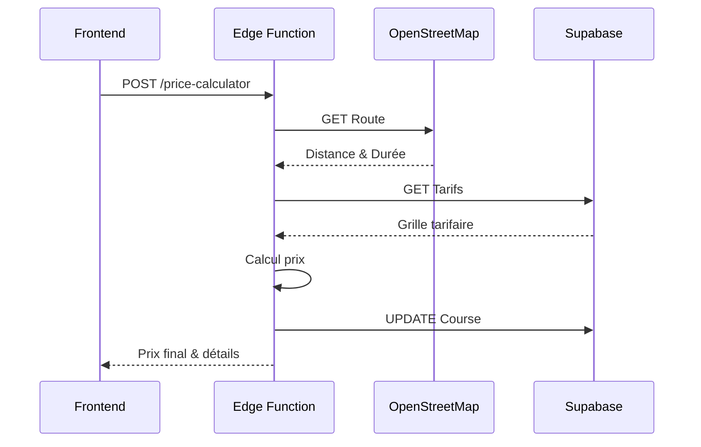

# Edge Function : Calcul Automatique et Sécurisé des Tarifs

## Objectif

L'Edge Function `price-calculator` assure le calcul automatique et sécurisé des tarifs pour toutes les courses, avec intégration OpenStreetMap pour les calculs de distance. Elle gère :
- Calcul précis des distances via OpenStreetMap
- Application des tarifs de base selon le type de véhicule
- Gestion des options (siège enfant, transport d'animaux)
- Prix minimum garanti
- Audit complet des calculs

## Architecture

### 1. Structure de l'Edge Function

```typescript
serve(async (req) => {
  // CORS handling for local development
  if (req.method === 'OPTIONS') {
    return new Response(null, {
      status: 200,
      headers: {
        'Access-Control-Allow-Origin': '*',
        'Access-Control-Allow-Methods': 'POST, OPTIONS',
        'Access-Control-Allow-Headers': 'Content-Type, Authorization, apikey, x-client-info',
        'Access-Control-Max-Age': '86400'
      }
    });
  }

  // Core logic...
});
```

### 2. Calcul de Route via OpenStreetMap

```typescript
const calculateRouteFromOSM = async (
  pickupLat: number,
  pickupLon: number,
  dropoffLat: number,
  dropoffLon: number
): Promise<{ distance: number; duration: number; source: string }> => {
  const osmUrl = `https://router.project-osrm.org/route/v1/driving/${pickupLon},${pickupLat};${dropoffLon},${dropoffLat}`;
  // Intégration avec OpenStreetMap pour calcul précis
};
```

### 3. Calcul des Tarifs

Les tarifs sont calculés selon la formule :
```typescript
// Prix de base
let totalPrice = rate.base_price + finalDistance * rate.price_per_km;

// Options supplémentaires
if (Array.isArray(ride.options)) {
  const validOptions = ['child_seat', 'pet_friendly'];
  const optionsPrice = validOptions.reduce((sum, opt) => {
    switch(opt) {
      case 'child_seat': return sum + 15;
      case 'pet_friendly': return sum + 10;
      default: return sum;
    }
  }, 0);
  totalPrice += optionsPrice;
}

// Prix minimum garanti
totalPrice = Math.max(totalPrice, rate.min_price);
```

## Flux de Données



## Sécurité et Validation

1. **Validation des Entrées**
   - Coordonnées GPS requises
   - Type de véhicule requis
   - Options validées contre une liste autorisée

2. **Gestion des Erreurs**
   - Timeouts OpenStreetMap (8s)
   - Validation des données Supabase
   - Logging des erreurs

3. **Audit**
   ```typescript
   await logAudit(supabaseClient, {
     event_type: 'price_calculation_with_osm',
     service: 'price_calculator_osm',
     ride_id: ride.id,
     calculated_price: totalPrice,
     metadata: { ... }
   });
   ```

## Réponse Type

```json
{
  "success": true,
  "price": 97.275,
  "breakdown": {
    "base": 45,
    "distance": 20.91,
    "duration": 27,
    "pricePerKm": 2.5,
    "minPrice": 50,
    "options": ["child_seat"],
    "totalPrice": 97.275,
    "routeSource": "osm"
  }
}
```

## Avantages

1. **Sécurité**
   - Calculs centralisés côté serveur
   - Validation complète des données
   - Audit des calculs

2. **Précision**
   - Distances réelles via OpenStreetMap
   - Prix minimum garanti
   - Gestion précise des options

3. **Maintenance**
   - Configuration centralisée des tarifs dans Supabase
   - Logs d'audit pour le débogage
   - Headers CORS configurés pour le développement

## Utilisation

```typescript
const { data, error } = await supabase.functions.invoke(
  'price-calculator',
  {
    body: {
      new: {
        id: reservationId,
        vehicle_type: selectedVehicle,
        pickup_lat: departure.lat,
        pickup_lon: departure.lon,
        dropoff_lat: destination.lat,
        dropoff_lon: destination.lon,
        options: selectedOptions
      }
    }
  }
);
```

