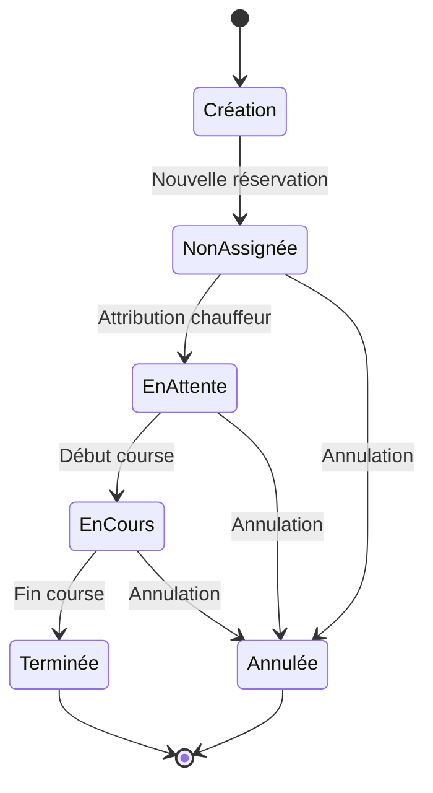

# Fonctionnalités de l'application

## Vue d'ensemble

Élégance Mobilité propose les fonctionnalités principales suivantes :

### 1. Système de courses
- Réservation en temps réel
- Suivi GPS
- Estimation des prix
- Historique des trajets
- [Documentation détaillée](./rides/README.md)

### 2. Gestion des chauffeurs
- Profils chauffeurs
- Disponibilités
- Statistiques de performance
- Documents administratifs
- [Documentation détaillée](./drivers/README.md)

### 3. Système de tarification
- Tarifs dynamiques
- Codes promotionnels
- Réductions entreprises
- Fidélisation chauffeurs
- [Documentation détaillée](./rates/README.md)

## Architecture technique

Les fonctionnalités sont construites sur :
- Next.js 14 pour le frontend
- Supabase pour la base de données et l'authentification
- Leaflet pour la cartographie
- Zustand pour la gestion d'état
- Radix UI pour les composants

## Cycle de vie d'une course



## Points d'entrée

### API Routes
- `/api/rides/*` : Gestion des courses
- `/api/drivers/*` : Gestion des chauffeurs
- `/api/rates/*` : Gestion des tarifs

### Pages principales
- `/reservation` : Réservation de course
- `/admin/rides` : Gestion des courses
- `/admin/drivers` : Gestion des chauffeurs

## Intégrations

### Services externes
- Stripe pour les paiements
- SendGrid pour les emails
- Mapbox pour le geocoding

### Webhooks
- `/api/webhooks/stripe` : Paiements
- `/api/webhooks/sendgrid` : Emails
- `/api/webhooks/location` : Positions GPS

## Sécurité

- Authentification Supabase
- RBAC pour les permissions
- Validation des données
- Rate limiting

## Tests

```bash
# Tests unitaires des fonctionnalités
npm run test:features

# Tests d'intégration
npm run test:integration

# Tests end-to-end
npm run test:e2e
```

## Documentation associée

- [Guide de développement](../guides/setup.md)
- [Architecture système](../architecture/system-overview.md)
- [Guide API](../api/README.md)
