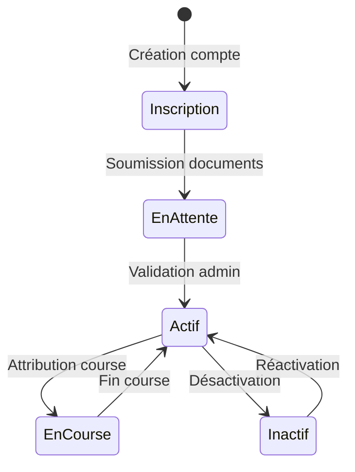

# Système de gestion des chauffeurs

## Vue d'ensemble

Le système de gestion des chauffeurs permet de gérer l'ensemble des chauffeurs VTC, leurs documents, disponibilités et performances.

## États d'un chauffeur



## Types de données

```typescript
interface Driver {
  id: string;
  userId: string;
  name: string;
  phone: string;
  email: string;
  status: DriverStatus;
  rating: number;
  totalRides: number;
  vehicle: Vehicle | null;
  documents: DriverDocuments;
  availability: Availability[];
  preferredZones: Zone[];
  languagesSpoken: string[];
  createdAt: Date;
  updatedAt: Date;
}

type DriverStatus = 
  | 'active'      // Disponible pour des courses
  | 'inactive'    // Temporairement indisponible
  | 'on_ride'     // En course
  | 'on_break'    // En pause
  | 'suspended';  // Compte suspendu

interface DriverDocuments {
  vtcCard: {
    number: string;
    expiryDate: Date;
    verifiedAt?: Date;
  };
  drivingLicense: {
    number: string;
    expiryDate: Date;
    verifiedAt?: Date;
  };
  insurance: {
    number: string;
    expiryDate: Date;
    verifiedAt?: Date;
  };
}
```

## Composants principaux

### 1. Tableau de bord chauffeur

```typescript
// src/components/drivers/DriverDashboard.tsx
const DriverDashboard = () => {
  const metrics = useDriverMetrics();
  const rides = useDriverRides();
  return (
    <DashboardLayout>
      <MetricsOverview data={metrics} />
      <UpcomingRides rides={rides.upcoming} />
      <RideHistory rides={rides.history} />
      <EarningsReport />
    </DashboardLayout>
  );
};
```

### 2. Gestion des disponibilités

```typescript
// src/components/drivers/AvailabilityCalendar.tsx
interface Availability {
  start: Date;
  end: Date;
  zone?: Zone;
  recurring?: boolean;
}

const AvailabilityEditor = () => {
  const { availabilities, updateAvailability } = useDriverAvailability();
  // ...
};
```

## API Routes

### Gestion des chauffeurs

```typescript
// src/app/api/drivers/route.ts
POST /api/drivers           // Création chauffeur
GET /api/drivers/:id       // Détails chauffeur
PATCH /api/drivers/:id     // Mise à jour chauffeur
DELETE /api/drivers/:id    // Suppression chauffeur

// Documents
POST /api/drivers/:id/documents    // Upload document
GET /api/drivers/:id/documents     // Liste documents

// Disponibilités
POST /api/drivers/:id/availability
GET /api/drivers/:id/availability
```

## Validation des documents

```typescript
// src/lib/services/documentValidationService.ts
interface DocumentValidation {
  validateVTCCard: (card: VTCCard) => Promise<ValidationResult>;
  validateDrivingLicense: (license: DrivingLicense) => Promise<ValidationResult>;
  validateInsurance: (insurance: Insurance) => Promise<ValidationResult>;
  checkExpiryDates: (documents: DriverDocuments) => ExpiryCheck[];
}
```

## Métriques et performances

```typescript
// src/lib/metrics/driverMetrics.ts
interface DriverMetrics {
  rides: {
    total: number;
    completed: number;
    cancelled: number;
    rating: number;
  };
  earnings: {
    total: number;
    thisMonth: number;
    lastMonth: number;
  };
  performance: {
    acceptanceRate: number;
    completionRate: number;
    averageRating: number;
  };
}
```

## Événements système

```typescript
type DriverEvent =
  | { type: 'DRIVER_REGISTERED'; driver: Driver }
  | { type: 'DOCUMENTS_SUBMITTED'; driver: Driver; documents: DriverDocuments }
  | { type: 'DRIVER_ACTIVATED'; driver: Driver }
  | { type: 'DRIVER_SUSPENDED'; driver: Driver; reason: string }
  | { type: 'AVAILABILITY_UPDATED'; driver: Driver; availability: Availability[] };
```

## Hooks personnalisés

```typescript
// src/hooks/useDriver.ts
const useDriver = (driverId: string) => {
  const { data, error } = useSWR(`/api/drivers/${driverId}`);
  return {
    driver: data,
    isLoading: !error && !data,
    error
  };
};

// src/hooks/useDriverActions.ts
const useDriverActions = (driverId: string) => {
  const activate = () => /* ... */;
  const suspend = () => /* ... */;
  const updateAvailability = () => /* ... */;
  
  return { activate, suspend, updateAvailability };
};
```

## Sécurité et vérifications

### Vérification des documents

```typescript
// src/lib/security/documentVerification.ts
const documentChecks = {
  validateDocument: async (doc: Document) => {
    // Vérification d'authenticité
    // Vérification de validité
    // Vérification d'expiration
  },
  scheduleExpiryCheck: (doc: Document) => {
    // Planification des alertes d'expiration
  }
};
```

## Tests

```bash
# Tests des validations
npm run test:drivers:validation

# Tests de disponibilité
npm run test:drivers:availability

# Tests d'intégration
npm run test:drivers:integration
```

## Documentation associée

- [Guide d'intégration](../api/drivers.md)
- [Schéma de base de données](../database/schemas/drivers.md)
- [Politique de validation](../policies/driver-validation.md)
