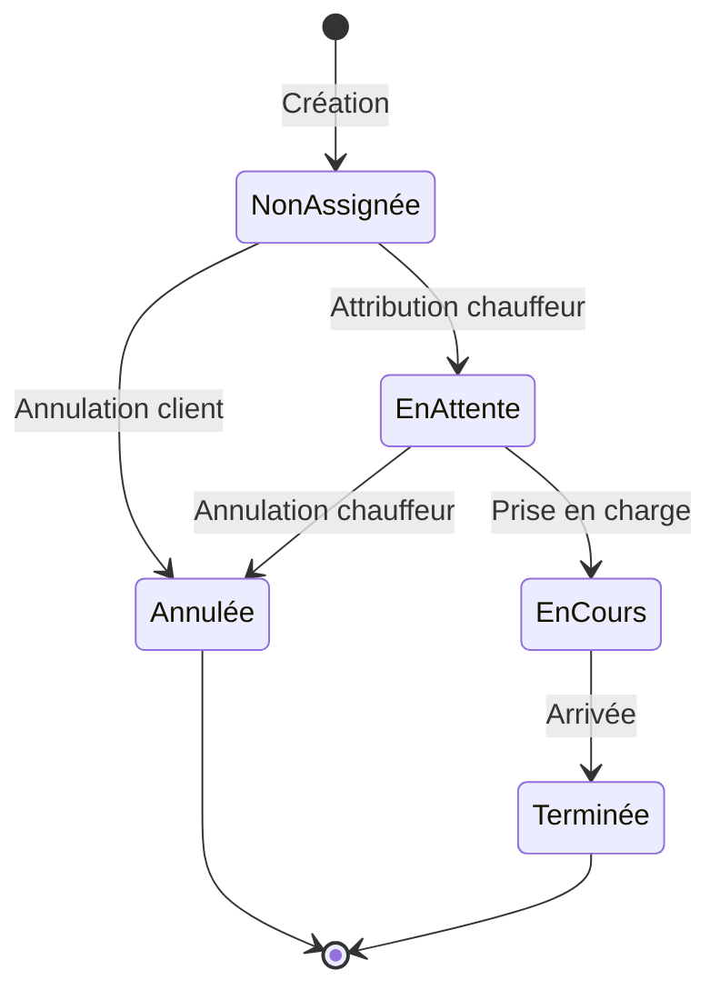

# Système de courses VTC

## Vue d'ensemble

Le système de courses est le cœur de l'application Élégance Mobilité, gérant le cycle complet des réservations VTC.

## États d'une course



## Types de données

```typescript
interface Ride {
  id: string;
  status: RideStatus;
  userId: string;
  driverId?: string;
  pickupAddress: string;
  dropoffAddress: string;
  pickupTime: Date;
  pickupLocation: GeoPoint;
  dropoffLocation: GeoPoint;
  estimatedPrice: number;
  finalPrice?: number;
  distance?: number;
  duration?: number;
  createdAt: Date;
  updatedAt: Date;
}

type RideStatus = 
  | 'unassigned'
  | 'pending'
  | 'in-progress'
  | 'completed'
  | 'cancelled';

interface GeoPoint {
  lat: number;
  lng: number;
}
```

## Composants clés

### 1. Flux de réservation

```typescript
// src/components/reservation/ReservationFlow.tsx
const ReservationSteps = [
  'location',  // Saisie des adresses
  'datetime',  // Choix date/heure
  'vehicle',   // Sélection véhicule
  'options',   // Options additionnelles
  'payment',   // Paiement
  'confirm'    // Confirmation
] as const;
```

### 2. Suivi en temps réel

```typescript
// src/hooks/useRideTracking.ts
const useRideTracking = (rideId: string) => {
  const { data, error } = useRealtimeLocation(rideId);
  return {
    currentLocation: data?.location,
    estimatedArrival: data?.eta,
    isLoading: !error && !data,
    error
  };
};
```

### 3. Attribution des courses

```typescript
// src/lib/services/assignmentService.ts
const assignmentService = {
  findBestDriver: async (ride: Ride): Promise<Driver | null> => {
    // Algorithme de matching basé sur :
    // - Proximité géographique
    // - Disponibilité
    // - Type de véhicule
    // - Note du chauffeur
  }
};
```

## API Routes

### Création et gestion

```typescript
// src/app/api/rides/route.ts
POST /api/rides          // Créer une course
GET /api/rides/:id       // Détails d'une course
PATCH /api/rides/:id     // Mettre à jour une course
DELETE /api/rides/:id    // Annuler une course
```

### Suivi en temps réel

```typescript
// src/app/api/rides/[id]/tracking/route.ts
GET /api/rides/:id/tracking      // Position actuelle
GET /api/rides/:id/status        // Statut en temps réel
POST /api/rides/:id/location     // Mise à jour position
```

## Calcul des prix

```typescript
// src/lib/services/pricingService.ts
interface PriceFactors {
  distance: number;      // Distance en km
  duration: number;      // Durée en minutes
  vehicleType: string;   // Type de véhicule
  timeOfDay: Date;      // Heure de la course
  options: string[];     // Options additionnelles
}

const calculatePrice = (factors: PriceFactors): number => {
  const basePrice = getBasePrice(factors.vehicleType);
  const distancePrice = factors.distance * getPricePerKm();
  const timeFactor = getTimeFactor(factors.timeOfDay);
  const optionsPrice = calculateOptionsPrice(factors.options);
  
  return basePrice + (distancePrice * timeFactor) + optionsPrice;
};
```

## Événements système

```typescript
// src/lib/events/rideEvents.ts
type RideEvent =
  | { type: 'RIDE_CREATED'; ride: Ride }
  | { type: 'DRIVER_ASSIGNED'; ride: Ride; driver: Driver }
  | { type: 'RIDE_STARTED'; ride: Ride }
  | { type: 'RIDE_COMPLETED'; ride: Ride }
  | { type: 'RIDE_CANCELLED'; ride: Ride; reason: string };
```

## Tests

```bash
# Tests unitaires
npm run test:rides

# Tests d'intégration
npm run test:integration:rides

# Tests end-to-end
npm run test:e2e:rides
```

## Hooks personnalisés

```typescript
// src/hooks/useRide.ts
const useRide = (rideId: string) => {
  const { data, error, mutate } = useSWR(`/api/rides/${rideId}`);
  
  return {
    ride: data,
    isLoading: !error && !data,
    error,
    refresh: mutate
  };
};

// src/hooks/useRideActions.ts
const useRideActions = (rideId: string) => {
  const start = () => /* ... */;
  const complete = () => /* ... */;
  const cancel = () => /* ... */;
  
  return { start, complete, cancel };
};
```

## Sécurité

- Vérification des permissions par rôle
- Validation des adresses
- Vérification de la disponibilité
- Protection contre les doubles réservations

## Métriques

```typescript
// src/lib/metrics/rideMetrics.ts
interface RideMetrics {
  totalRides: number;
  completionRate: number;
  averageRating: number;
  averageDuration: number;
  popularRoutes: Route[];
}
```

## Documentation associée

- [Guide API](../../api/rides.md)
- [Modèle de données](../../database/schemas/rides.md)
- [Guide de déploiement](../../guides/deployment.md)
