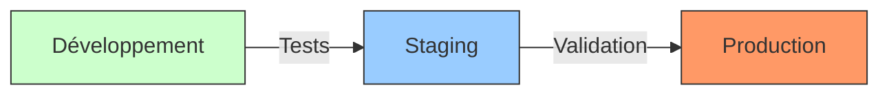

# Guide de déploiement

## Vue d'ensemble des environnements



## Configuration des environnements

### Variables d'environnement par environnement

```env
# Production (.env.production)
NEXT_PUBLIC_SUPABASE_URL=https://prod.supabase.co
DATABASE_URL=postgres://prod
STRIPE_SECRET_KEY=sk_prod
SENDGRID_API_KEY=prod_key

# Staging (.env.staging)
NEXT_PUBLIC_SUPABASE_URL=https://staging.supabase.co
DATABASE_URL=postgres://staging
STRIPE_SECRET_KEY=sk_test
SENDGRID_API_KEY=test_key
```

## Déploiement sur Vercel

### 1. Configuration initiale

```bash
# Installation de Vercel CLI
npm i -g vercel

# Login
vercel login

# Initialisation du projet
vercel link
```

### 2. Configuration des domaines

```bash
# Production
vercel domains add elegance-mobilite.com

# Staging
vercel domains add staging.elegance-mobilite.com
```

### 3. Déploiement

```bash
# Déploiement en production
vercel --prod

# Déploiement en staging
vercel
```

## Déploiement manuel

### 1. Build de l'application

```bash
# Installation des dépendances
npm ci

# Build
npm run build

# Test du build
npm run start
```

### 2. Configuration Nginx

```nginx
# /etc/nginx/sites-available/elegance-mobilite

server {
    listen 80;
    server_name elegance-mobilite.com;
    
    location / {
        proxy_pass http://localhost:3000;
        proxy_http_version 1.1;
        proxy_set_header Upgrade $http_upgrade;
        proxy_set_header Connection 'upgrade';
        proxy_set_header Host $host;
        proxy_cache_bypass $http_upgrade;
    }
}
```

### 3. Configuration SSL (Certbot)

```bash
# Installation du certificat
sudo certbot --nginx -d elegance-mobilite.com

# Renouvellement automatique
sudo certbot renew --dry-run
```

## Migrations de base de données

### 1. Backup avant migration

```bash
# Backup de la base de données
pg_dump -U postgres elegance_mobilite > backup_$(date +%Y%m%d).sql

# Vérification du backup
ls -lh backup_*.sql
```

### 2. Exécution des migrations

```bash
# Migration en staging
psql -h staging-db -U postgres -d elegance_mobilite -f migrations/*.sql

# Migration en production
psql -h prod-db -U postgres -d elegance_mobilite -f migrations/*.sql
```

## Monitoring et logs

### 1. Configuration des logs

```typescript
// src/lib/logger.ts
const logger = {
  info: (msg: string) => console.log(`[INFO] ${msg}`),
  error: (msg: string) => console.error(`[ERROR] ${msg}`),
  warn: (msg: string) => console.warn(`[WARN] ${msg}`)
};
```

### 2. Surveillance des performances

- Vercel Analytics
- Sentry pour le tracking d'erreurs
- Supabase Dashboard pour la BDD

## Rollback

### 1. Application

```bash
# Retour à la version précédente
vercel rollback

# Vérification du statut
vercel list
```

### 2. Base de données

```bash
# Restauration du backup
psql -h prod-db -U postgres -d elegance_mobilite < backup_*.sql
```

## CI/CD

### GitHub Actions

```yaml
name: Deploy
on:
  push:
    branches: [main]
  
jobs:
  deploy:
    runs-on: ubuntu-latest
    steps:
      - uses: actions/checkout@v2
      - uses: actions/setup-node@v2
      - run: npm ci
      - run: npm test
      - run: npm run build
      - uses: vercel/actions/cli@v2
        with:
          vercel-token: ${{ secrets.VERCEL_TOKEN }}
```

## Checklist de déploiement

- [ ] Tests passés
- [ ] Variables d'environnement configurées
- [ ] Migrations de BDD exécutées
- [ ] SSL/TLS configuré
- [ ] DNS mis à jour
- [ ] Monitoring actif
- [ ] Backup récent disponible

## Support et maintenance

### Contacts

- Support technique : tech@elegance-mobilite.com
- Support urgent : urgence@elegance-mobilite.com
- NOC : noc@elegance-mobilite.com

### Documentation connexe

- [Guide de maintenance](./maintenance.md)
- [Procédures d'urgence](./emergency.md)
- [SLA et garanties](./sla.md)
