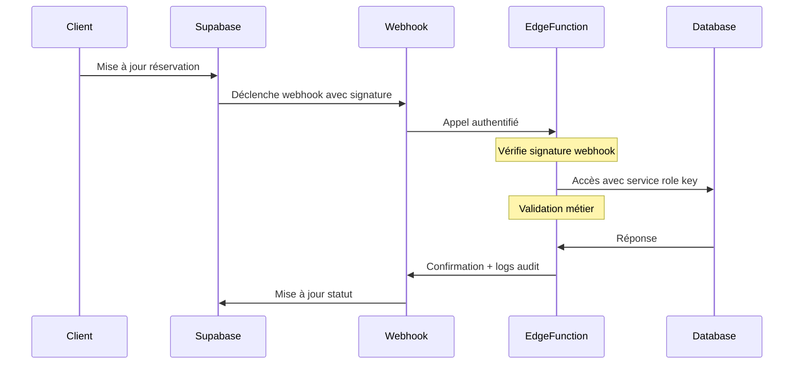

# Implémentation Sécurisée des Webhooks pour le Calcul de Prix

## Contexte

Les webhooks de calcul de prix rencontrent actuellement une erreur 401 "Missing authorization header" car l'authentification native de Supabase/SSR ne se propage pas automatiquement. Cette documentation détaille l'implémentation sécurisée d'une solution utilisant une service role key.

## Architecture Sécurisée



## Étapes d'Implémentation

### 1. Configuration de la Service Role Key

1. Créer une nouvelle service role key dans Supabase spécifique aux webhooks :
   - Dashboard Supabase > Settings > API
   - Créer une nouvelle "service_role key"
   - Nommer la clé "webhook_price_calculator"

2. Configurer les variables d'environnement :
```bash
SUPABASE_WEBHOOK_KEY=votre_service_role_key
SUPABASE_SERVICE_ROLE_KEY=votre_webhook_secret
```

### 2. Modification de l'Edge Function

Mettre à jour `price-calculator.ts` :

```typescript
import { createClient } from '@supabase/supabase-js';

export const onRequest = async (req: Request, ctx: any) => {
  // 1. Vérification de la signature webhook
  const signature = req.headers.get('x-webhook-signature');
  if (!validateWebhookSignature(signature, await req.clone().text())) {
    return new Response(JSON.stringify({
      error: 'Invalid webhook signature'
    }), { status: 401 });
  }

  // 2. Configuration client Supabase avec service role
  const supabase = createClient(
    process.env.SUPABASE_URL!,
    process.env.SUPABASE_WEBHOOK_KEY!,
    {
      auth: {
        persistSession: false,
        autoRefreshToken: false
      }
    }
  );

  try {
    // ... Reste du code existant ...

    // 3. Ajout des logs d'audit
    await logAuditEvent(supabase, {
      event_type: 'price_calculation',
      ride_id: ride.id,
      calculated_price: totalPrice,
      timestamp: new Date().toISOString()
    });

    return new Response(JSON.stringify({
      success: true,
      price: totalPrice
    }));

  } catch (error) {
    // 4. Log des erreurs
    console.error('Price calculation error:', error);
    return new Response(JSON.stringify({
      error: 'Internal server error',
      details: error instanceof Error ? error.message : 'Unknown error'
    }), { status: 500 });
  }
};

// Fonction de validation de signature
function validateWebhookSignature(signature: string | null, payload: string): boolean {
  if (!signature || !process.env.SUPABASE_SERVICE_ROLE_KEY) {
    return false;
  }
  
  const crypto = require('crypto');
  const expectedSignature = crypto
    .createHmac('sha256', process.env.SUPABASE_SERVICE_ROLE_KEY)
    .update(payload)
    .digest('hex');

  return crypto.timingSafeEqual(
    Buffer.from(signature),
    Buffer.from(expectedSignature)
  );
}

// Fonction de logging des audits
async function logAuditEvent(supabase: any, eventData: any) {
  const { error } = await supabase
    .from('audit_logs')
    .insert([{
      ...eventData,
      service: 'price_calculator_webhook'
    }]);

  if (error) {
    console.error('Audit log error:', error);
  }
}
```

### 3. Configuration du Webhook dans Supabase

1. Dans le dashboard Supabase:
   - Database > Webhooks
   - Configurer le webhook pour les événements de mise à jour de rides
   - Ajouter le header de signature : `x-webhook-signature`

2. Créer la table d'audit:

```sql
CREATE TABLE audit_logs (
  id uuid DEFAULT uuid_generate_v4() PRIMARY KEY,
  event_type text NOT NULL,
  service text NOT NULL,
  ride_id uuid REFERENCES rides(id),
  calculated_price decimal(10,2),
  timestamp timestamptz DEFAULT now(),
  metadata jsonb DEFAULT '{}'::jsonb
);

-- Politique RLS pour audit_logs
CREATE POLICY "Admins can view audit logs"
ON audit_logs
FOR SELECT
TO authenticated
USING (get_user_app_role() IN ('app_admin', 'app_super_admin'));
```

## Tests et Validation

1. Tests unitaires à ajouter :
```typescript
describe('Webhook Security', () => {
  it('should validate webhook signature', () => {
    // Test de validation de signature
  });
  
  it('should reject invalid signatures', () => {
    // Test de rejet des signatures invalides
  });
  
  it('should log audit events', () => {
    // Test de logging des événements
  });
});
```

2. Tests manuels :
   - Vérifier le calcul de prix avec différents scénarios
   - Vérifier les logs d'audit
   - Tester les cas d'erreur et les limites

## Monitoring et Maintenance

1. Mettre en place des alertes pour :
   - Erreurs d'authentification répétées
   - Échecs de calcul de prix
   - Latence anormale

2. Vérifications régulières :
   - Examiner les logs d'audit
   - Vérifier les performances
   - Mettre à jour les clés de service selon la politique de sécurité

## Notes de Sécurité

- La service role key doit être rotée régulièrement
- Les logs d'audit doivent être conservés selon la politique de rétention
- Les erreurs ne doivent pas exposer d'informations sensibles
- La validation de signature est critique pour la sécurité

## Support et Dépannage

En cas d'erreur :
1. Vérifier les logs d'audit
2. Confirmer la validité des signatures
3. Vérifier les permissions de la service role key
4. Examiner les logs Supabase pour plus de détails